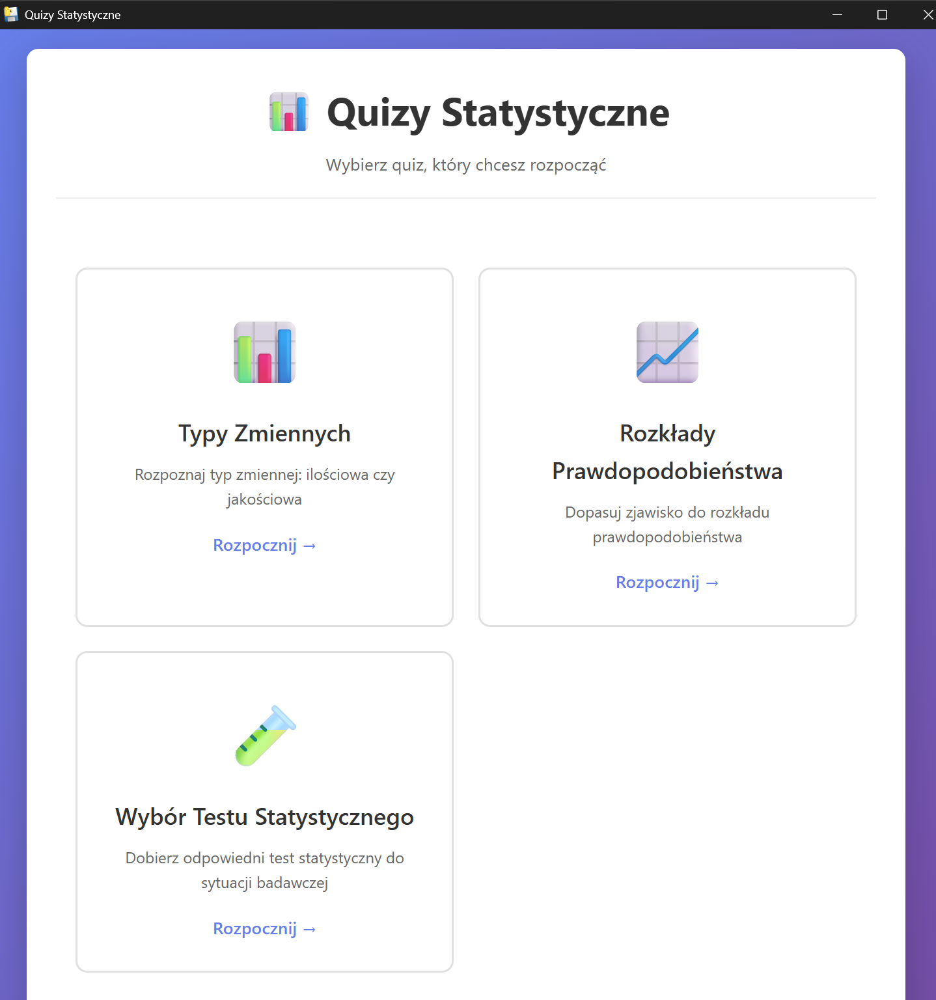
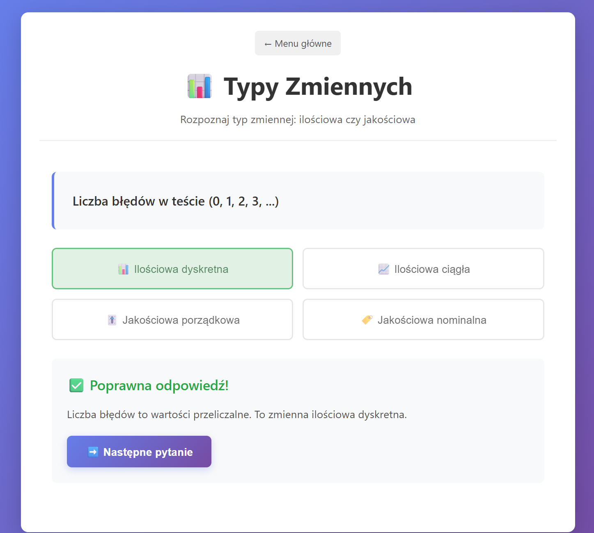
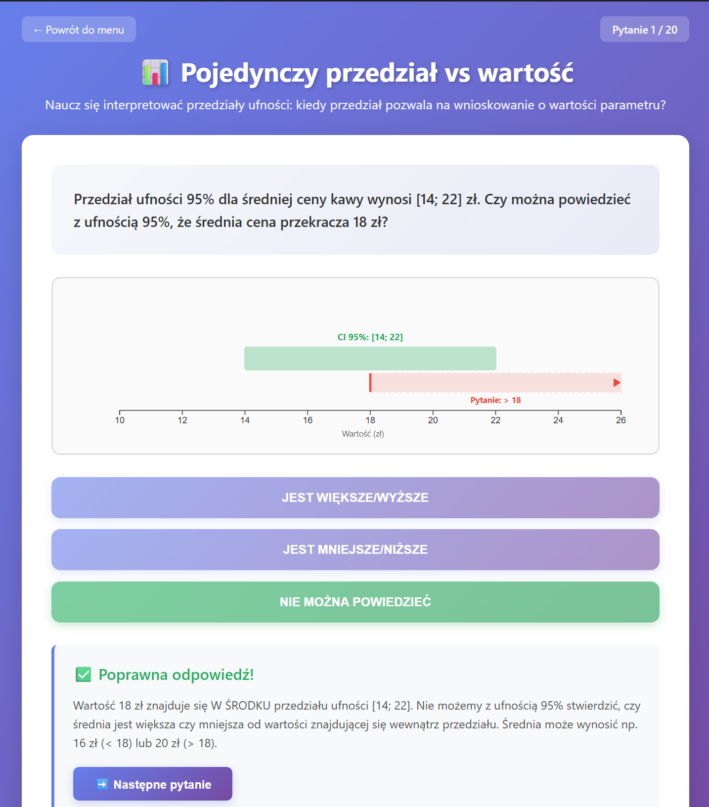

# Statystyczne Zabawki

[](https://creativecommons.org/licenses/by/4.0/)

Interaktywne aplikacje do nauki statystyki. Pobierz, uruchom i ucz sie przez eksploracje - bez instalacji dodatkowego oprogramowania!

## Co to jest?

**Statystyczne Zabawki** to zestaw prostych aplikacji edukacyjnych dla studentow. Kazda aplikacja to jeden plik `.exe`, ktory:

- Dziala offline - nie wymaga internetu
- Nie wymaga instalacji - pobierasz i uruchamiasz
- Jest interaktywna - suwaki, przyciski, wykresy na zywo
- Pomaga zrozumiec statystyke przez zabaw

## Dostepne aplikacje

| Aplikacja | Co robi? | Pobierz |
|-----------|----------|---------|
| **Quiz Statystyczny** | Sprawdz swoja wiedze: typy zmiennych, rozklady, wybor testu, hipotezy, interpretacja wynikow | [Pobierz](../../releases) |
| **Przedzialy Ufnosci** | Naucz sie interpretowac przedzialy ufnosci | [Pobierz](../../releases) |
| **Histogram** | Zobacz jak parametry wplywaja na ksztalt histogramu | [Pobierz](../../releases) |
| **Test Chi-Kwadrat** | Interaktywna eksploracja testu niezaleznosci chi-kwadrat | [Pobierz](../../releases) |
| **Korelacja Pearsona** | Wykres rozrzutu, regresja i wspolczynnik korelacji na zywo | [Pobierz](../../releases) |
| **Obciazenie probkowania** | Jak niereprezentatywna proba prowadzi do blednych wnioskow | [Pobierz](../../releases) |
| **Przewodnik Wyboru Testu** | Krok po kroku dobierz test statystyczny i wariant hipotez z drzewa decyzyjnego | [Pobierz](../../releases) |

## Zobacz jak wygladaja

### Quiz Statystyczny
Wybierz jeden z pieciu quizow i sprawdz swoja wiedze:



Kazde pytanie zawiera wyjasnienie poprawnej odpowiedzi:



### Przedzialy Ufnosci
Interaktywna nauka interpretacji przedzialow ufnosci z wizualizacja:



### Test Chi-Kwadrat
Eksploruj test niezaleznosci chi-kwadrat: suwaki procentowe lub edycja komorek tabeli kontyngencji, wykres slupkowy (obserwowane vs oczekiwane), statystyki na zywo (chi-kwadrat, p-value, V Cramera).

### Korelacja Pearsona
Dodawaj i usuwaj punkty na wykresie rozrzutu, obserwuj jak zmienia sie wspolczynnik korelacji, prosta regresji i przedzialy ufnosci. Gotowe eksperymenty: wplyw outlierow, pulapki Anscombe'a, ograniczenie zakresu.

### Obciazenie probkowania
Zobacz jak niereprezentatywna proba prowadzi do blednych wnioskow statystycznych. Trzy interaktywne scenariusze z historiami: ograniczenie zakresu (ankieta w luksusowym hotelu), obcinanie proby (tylko studenci, ktorzy zdali), paradoks Simpsona (badanie w domu seniora). Porownuj korelacje w populacji i obciazonej probie, rysuj wlasny region selekcji.

## Jak pobrac i uruchomic?

1. Kliknij **[Releases](../../releases)** (lub link "Pobierz" przy wybranej aplikacji)
2. Znajdz najnowsza wersje i pobierz plik `.exe`
3. Dwuklik na pobranym pliku - aplikacja sie uruchomi
4. Gotowe!

## Czy to bezpieczne?

**Tak, aplikacje sa bezpieczne.**

Przy pierwszym uruchomieniu Windows Defender lub SmartScreen moga wyswietlic ostrzezenie. To normalne i nie oznacza, ze aplikacja jest niebezpieczna.

**Dlaczego pojawia sie ostrzezenie?**

Windows wyswietla takie komunikaty dla aplikacji, ktore nie maja platnego certyfikatu cyfrowego (kosztuje kilkaset dolarow rocznie). To samo ostrzezenie zobaczysz przy wielu darmowych programach edukacyjnych i open-source.

**Co mozesz zrobic:**
- Kliknij "Wiecej informacji" -> "Uruchom mimo to"
- Caly kod zrodlowy jest dostepny publicznie w tym repozytorium - mozesz go przejrzec

## Dla Mac/Linux

Obecnie aplikacje sa dostepne tylko dla Windows. Uzytownicy Mac/Linux moga uruchomic aplikacje z kodu zrodlowego:

```bash
cd toys/nazwa_zabawki
pip install -r requirements.txt
python main.py
```

## Licencja

Projekt na licencji [CC BY 4.0](LICENSE) - mozesz swobodnie uzywac i udostepniac, pod warunkiem podania autorstwa.

## Kontakt

Projekt tworzony przez Macieja Karczewskiego (Uniwersytet Przyrodniczy we Wrocławiu) dla potrzeb dydaktycznych. Feedback i sugestie mile widziane!
